# CKB Review — CI/CD Code Review Engine

## Entscheidung

**Direkt in CKB integriert** — kein Modul-System, keine separate App.

Begründung:
- Engine-zentrische Architektur: eine Methode auf `Engine` → automatisch CLI + HTTP + MCP
- `PresetReview` existiert bereits, wird erweitert
- Alle Analyse-Bausteine sind implementiert — es fehlt nur Orchestrierung + Präsentation
- Kein LLM nötig — rein strukturelle/statische Analyse

## Architektur



```
ckb review (CLI)  ─┐
POST /review/pr   ─┤──→ Engine.ReviewPR() ──→ Orchestriert:
reviewPR (MCP)    ─┘     │                     ├─ SummarizePR()           [existiert]
                         │                     ├─ CompareAPI()            [existiert]
                         │                     ├─ GetAffectedTests()      [existiert]
                         │                     ├─ AuditRisk()             [existiert]
                         │                     ├─ GetHotspots()           [existiert]
                         │                     ├─ GetOwnership()          [existiert]
                         │                     ├─ ScanSecrets()           [existiert]
                         │                     ├─ CheckCouplingGaps()     [NEU]
                         │                     ├─ CompareComplexity()     [NEU]
                         │                     ├─ SuggestPRSplit()        [NEU]
                         │                     ├─ DetectGeneratedFiles()  [NEU]
                         │                     └─ CheckCriticalPaths()    [NEU]
                         │
                         ▼
                    ReviewPRResponse
                         │
                    ┌────┴────────────────────┐
                    ▼         ▼         ▼      ▼
                  human    markdown    sarif   codeclimate
                  (CLI)    (PR comment) (GitHub (GitLab
                            + annotations) Scanning) native)
```

## Phase 1: Engine — `internal/query/review.go`

### ReviewPROptions

```go
type ReviewPROptions struct {
    BaseBranch  string        `json:"baseBranch"`  // default: "main"
    HeadBranch  string        `json:"headBranch"`  // default: HEAD
    Policy      *ReviewPolicy `json:"policy"`      // Quality gates (or from .ckb/review.json)
    Checks      []string      `json:"checks"`      // Filter: ["breaking","secrets","tests","complexity","coupling","risk","hotspots","size","split","generated","critical"]
    MaxInline   int           `json:"maxInline"`   // Max inline suggestions (default: 10)
}

type ReviewPolicy struct {
    // Gates (fail if violated)
    NoBreakingChanges  bool    `json:"noBreakingChanges"`  // default: true
    NoSecrets          bool    `json:"noSecrets"`          // default: true
    RequireTests       bool    `json:"requireTests"`       // default: false
    MaxRiskScore       float64 `json:"maxRiskScore"`       // default: 0.7 (0 = disabled)
    MaxComplexityDelta int     `json:"maxComplexityDelta"` // default: 0 (disabled)
    MaxFiles           int     `json:"maxFiles"`           // default: 0 (disabled)

    // Behavior
    FailOnLevel string `json:"failOnLevel"` // "error" (default), "warning", "none"
    HoldTheLine bool   `json:"holdTheLine"` // Only flag issues on changed lines (default: true)

    // Large PR handling
    SplitThreshold int `json:"splitThreshold"` // Suggest split above N files (default: 50)

    // Generated file detection
    GeneratedPatterns []string `json:"generatedPatterns"` // Glob patterns for generated files
    GeneratedMarkers  []string `json:"generatedMarkers"`  // Comment markers: ["DO NOT EDIT", "Generated by"]

    // Safety-critical paths (SCADA, automotive, medical, etc.)
    CriticalPaths    []string `json:"criticalPaths"`    // Glob patterns: ["drivers/hw/**", "protocol/**"]
    CriticalSeverity string   `json:"criticalSeverity"` // Severity when critical paths are touched (default: "error")
}
```

### ReviewPRResponse

```go
type ReviewPRResponse struct {
    Verdict        string               `json:"verdict"`        // "pass", "warn", "fail"
    Score          int                  `json:"score"`          // 0-100 (100 = perfect)
    Summary        ReviewSummary        `json:"summary"`
    Checks         []ReviewCheck        `json:"checks"`
    Findings       []ReviewFinding      `json:"findings"`       // All findings, sorted by severity
    Reviewers      []ReviewerAssignment `json:"reviewers"`      // Reviewers with per-cluster assignments
    SplitSuggestion *PRSplitSuggestion  `json:"splitSuggestion,omitempty"` // If PR is large
    ReviewEffort   *ReviewEffort        `json:"reviewEffort,omitempty"`    // Estimated review time
    Provenance     *Provenance          `json:"provenance"`
}

type ReviewSummary struct {
    TotalFiles       int      `json:"totalFiles"`
    TotalChanges     int      `json:"totalChanges"`     // additions + deletions
    GeneratedFiles   int      `json:"generatedFiles"`   // Files detected as generated (excluded from review)
    ReviewableFiles  int      `json:"reviewableFiles"`  // TotalFiles - GeneratedFiles
    CriticalFiles    int      `json:"criticalFiles"`    // Files in critical paths
    ChecksPassed     int      `json:"checksPassed"`
    ChecksWarned     int      `json:"checksWarned"`
    ChecksFailed     int      `json:"checksFailed"`
    ChecksSkipped    int      `json:"checksSkipped"`
    TopRisks         []string `json:"topRisks"`         // Top 3 human-readable risk factors
    Languages        []string `json:"languages"`
    ModulesChanged   int      `json:"modulesChanged"`
}

type ReviewCheck struct {
    Name     string      `json:"name"`     // "breaking-changes", "secrets", "tests", etc.
    Status   string      `json:"status"`   // "pass", "warn", "fail", "skip"
    Severity string      `json:"severity"` // "error", "warning", "info"
    Summary  string      `json:"summary"`  // One-line: "2 breaking changes detected"
    Details  interface{} `json:"details"`  // Check-specific: breaking.Changes[], etc.
    Duration int64       `json:"durationMs"`
}

type ReviewFinding struct {
    Check      string `json:"check"`               // Which check produced this
    Severity   string `json:"severity"`             // "error", "warning", "info"
    File       string `json:"file"`
    StartLine  int    `json:"startLine,omitempty"`
    EndLine    int    `json:"endLine,omitempty"`
    Message    string `json:"message"`              // Short: "Removed public function Foo()"
    Detail     string `json:"detail,omitempty"`     // Longer explanation
    Suggestion string `json:"suggestion,omitempty"` // Concrete action to take
    Category   string `json:"category"`             // "breaking", "security", "testing", "complexity", "coupling", "risk", "critical", "generated", "split"
    RuleID     string `json:"ruleId,omitempty"`     // For SARIF: "ckb/breaking/removed-symbol"
}

// --- New types for large-PR handling ---

// PRSplitSuggestion recommends how to split a large PR into independent chunks.
type PRSplitSuggestion struct {
    Reason       string          `json:"reason"`       // "PR has 623 files across 8 independent clusters"
    Clusters     []PRCluster     `json:"clusters"`     // Independent change clusters
    EstimatedGain string         `json:"estimatedGain"` // "3x faster review (3×2h vs 1×6h)"
}

type PRCluster struct {
    Name          string   `json:"name"`          // Auto-generated: "Protocol Handler Refactor"
    Module        string   `json:"module"`        // Primary module
    Files         []string `json:"files"`         // Files in this cluster
    FileCount     int      `json:"fileCount"`
    Additions     int      `json:"additions"`
    Deletions     int      `json:"deletions"`
    CouplingScore float64  `json:"couplingScore"` // Internal cohesion (0-1, high = tightly coupled)
    Independent   bool     `json:"independent"`   // true if no coupling to other clusters
    Reviewers     []string `json:"reviewers"`     // Suggested reviewers for THIS cluster
}

// ReviewerAssignment extends SuggestedReview with per-cluster assignments.
type ReviewerAssignment struct {
    Owner       string              `json:"owner"`
    TotalFiles  int                 `json:"totalFiles"`     // Total files they should review
    Coverage    float64             `json:"coverage"`       // % of reviewable files they own
    Confidence  float64             `json:"confidence"`
    Assignments []ClusterAssignment `json:"assignments"`    // What to review per cluster
}

type ClusterAssignment struct {
    Cluster   string `json:"cluster"`   // Cluster name
    FileCount int    `json:"fileCount"` // Files to review in this cluster
    Reason    string `json:"reason"`    // "Primary owner of protocol/ (84% commits)"
}

// ReviewEffort estimates review time based on metrics.
type ReviewEffort struct {
    EstimatedHours  float64 `json:"estimatedHours"`  // Total for this PR
    SplitEstimate   float64 `json:"splitEstimate"`   // Per-chunk if split
    Factors         []string `json:"factors"`         // What drives the estimate
    Complexity      string  `json:"complexity"`       // "low", "medium", "high"
}

// GeneratedFileInfo tracks detected generated files.
type GeneratedFileInfo struct {
    File      string `json:"file"`
    Reason    string `json:"reason"`    // "Matches pattern *.generated.go" or "Contains 'DO NOT EDIT' marker"
    SourceFile string `json:"sourceFile,omitempty"` // The source that generates this (e.g. .y → .c for flex/yacc)
}
```

### Orchestrierung

```go
func (e *Engine) ReviewPR(ctx context.Context, opts ReviewPROptions) (*ReviewPRResponse, error) {
    // 1. Load policy from .ckb/review.json if not provided
    // 2. Run enabled checks in parallel (errgroup)
    // 3. Collect findings, apply hold-the-line filter
    // 4. Sort findings by severity (error > warning > info), then by file
    // 5. Calculate score (100 - deductions per finding)
    // 6. Determine verdict based on policy.FailOnLevel
    // 7. Get suggested reviewers from ownership
    // 8. Return response
}
```

**Parallelisierung:** Alle Checks laufen parallel via `errgroup`. Jeder Check ist unabhängig. Die Engine cached Hotspot-Daten intern, also kein doppeltes Laden.

### Neue Sub-Checks

#### CheckCouplingGaps — `internal/query/review_coupling.go`

Nutzt `internal/coupling/` (existiert). Vergleicht das Changeset mit historischen Co-Change-Patterns.

```go
type CouplingGap struct {
    ChangedFile   string  `json:"changedFile"`
    MissingFile   string  `json:"missingFile"`
    CoChangeRate  float64 `json:"coChangeRate"`  // 0-1, how often they change together
    LastCoChange  string  `json:"lastCoChange"`  // Date
}
```

Output: "You changed `handler.go` but not `handler_test.go` (87% co-change rate)"

#### CompareComplexity — `internal/query/review_complexity.go`

Nutzt `internal/complexity/` (existiert, tree-sitter-basiert). Berechnet Delta pro File.

```go
type ComplexityDelta struct {
    File               string `json:"file"`
    CyclomaticBefore   int    `json:"cyclomaticBefore"`
    CyclomaticAfter    int    `json:"cyclomaticAfter"`
    CyclomaticDelta    int    `json:"cyclomaticDelta"`
    CognitiveBefore    int    `json:"cognitiveBefore"`
    CognitiveAfter     int    `json:"cognitiveAfter"`
    CognitiveDelta     int    `json:"cognitiveDelta"`
    HottestFunction    string `json:"hottestFunction,omitempty"` // Function with highest delta
}
```

Output: "Cyclomatic complexity of `parseQuery()` in `engine.go` increased 12 → 18 (+50%)"

#### SuggestPRSplit — `internal/query/review_split.go`

Analysiert das Changeset und gruppiert Files in unabhängige Cluster basierend auf:
1. **Modul-Zugehörigkeit** — Files im selben Modul gehören zusammen
2. **Coupling-Daten** — Files die historisch zusammen geändert werden gehören zusammen
3. **Import/Include-Chains** — Files die sich gegenseitig referenzieren gehören zusammen (via SCIP)

```go
func (e *Engine) SuggestPRSplit(ctx context.Context, changedFiles []string) (*PRSplitSuggestion, error) {
    // 1. Build adjacency graph from coupling data + SCIP references
    // 2. Find connected components (= independent clusters)
    // 3. Name clusters by primary module
    // 4. Calculate per-cluster metrics
    // 5. Assign reviewers per cluster from ownership data
    // 6. Estimate review time reduction
}
```

Output bei 600-File-PR:
```
PR Split Suggestion: 623 files across 4 independent clusters

  Cluster 1: "Protocol Handler Refactor"     — 120 files (+2,340 −890)
    Reviewers: @alice (protocol owner), @bob (network module)

  Cluster 2: "UI Widget Migration"            — 85 files (+1,200 −430)
    Reviewers: @charlie (frontend owner)

  Cluster 3: "Config Schema v3"               — 53 files (+340 −120)
    Reviewers: @alice (config owner)

  Cluster 4: "Test Updates"                   — 365 files (+4,100 −3,800)
    Reviewers: @dave (test infrastructure)

  Clusters 1+2 are fully independent — safe to split into separate PRs.
  Cluster 3 depends on Cluster 1 — must be merged after or together.
  Estimated review time: 6h as-is → 3×2h if split.
```

Triggert automatisch wenn `totalFiles > policy.SplitThreshold` (default: 50).

#### DetectGeneratedFiles — `internal/query/review_generated.go`

Erkennt generierte Files über drei Wege:
1. **Marker-Comments** — `"DO NOT EDIT"`, `"Generated by"`, `"AUTO-GENERATED"` in den ersten 10 Zeilen
2. **Glob-Patterns** — Konfigurierbar in Policy: `["*.generated.*", "*.pb.go", "parser.tab.c"]`
3. **Source-Mapping** — Erkennt flex/yacc Paare: wenn `parser.y` im Changeset ist und `parser.tab.c` auch, dann ist `.tab.c` generated

```go
type GeneratedFileResult struct {
    GeneratedFiles []GeneratedFileInfo `json:"generatedFiles"`
    TotalExcluded  int                 `json:"totalExcluded"`
    SourceFiles    []string            `json:"sourceFiles"` // The actual files to review (.y, .l, .proto, etc.)
}
```

Generierte Files werden:
- Aus der Review-Findings-Liste **ausgeschlossen** (kein Noise)
- Im Summary als eigene Zeile gezeigt: "365 generated files excluded, 258 reviewable"
- **Aber:** Wenn die Source-Datei (.y, .l, .proto) geändert wurde, wird das als eigenes Finding gemeldet mit Link zum generierten Output

Besonders relevant für:
- **flex/yacc** → `.l`/`.y` → `.c`/`.h`
- **protobuf** → `.proto` → `.pb.go`/`.pb.cc`
- **code generators** → templates → output

#### CheckCriticalPaths — `internal/query/review_critical.go`

Prüft ob der PR Files in safety-critical Pfaden berührt (konfiguriert in Policy).

```go
type CriticalPathResult struct {
    CriticalFiles []CriticalFileHit `json:"criticalFiles"`
    Escalated     bool              `json:"escalated"`  // true if any critical file was touched
}

type CriticalFileHit struct {
    File         string   `json:"file"`
    Pattern      string   `json:"pattern"`      // Which criticalPaths pattern matched
    Additions    int      `json:"additions"`
    Deletions    int      `json:"deletions"`
    BlastRadius  int      `json:"blastRadius"`  // How many other files depend on this
    Suggestion   string   `json:"suggestion"`   // "Requires sign-off from safety team"
}
```

Output:
```
⚠ CRITICAL PATH: 3 files in safety-critical paths changed

  drivers/hw/plc_comm.cpp:42     Pattern: drivers/hw/**
    Blast radius: 47 files depend on this
    → Requires sign-off from safety team

  protocol/modbus_handler.cpp    Pattern: protocol/**
    Blast radius: 23 files
    → Requires sign-off from safety team

  plc/runtime/interpreter.cpp    Pattern: plc/**
    Blast radius: 112 files
    → Requires sign-off from safety team + integration test run
```

Bei SCADA/Industrie: konfigurierbar mit eigenen Severity-Leveln und erzwungenen Reviewer-Zuweisungen.

### Review Effort Estimation

Basierend auf:
- File count (reviewable, nicht generated)
- Durchschnittliche Complexity der geänderten Files
- Anzahl Module (context switches = langsamer)
- Critical path files (brauchen mehr Aufmerksamkeit)
- Hotspot files (brauchen mehr Aufmerksamkeit)

Formel (empirisch, kalibrierbar):
```
base = reviewableFiles * 2min
+ complexFiles * 5min
+ criticalFiles * 15min
+ hotspotFiles * 5min
+ moduleSwitches * 10min (context switch overhead)
```

Output: "Estimated review effort: ~6h (258 files, 3 critical, 12 hotspots, 8 module switches)"

## Phase 2: CLI — `cmd/ckb/review.go`

```bash
# Local development
ckb review                                    # Review current branch vs main
ckb review --base=develop                     # Custom base branch
ckb review --checks=breaking,secrets          # Only specific checks

# CI mode
ckb review --ci                               # Exit codes: 0=pass, 1=fail, 2=warn
ckb review --ci --fail-on=warning             # Stricter: warn also fails

# Output formats
ckb review --format=human                     # Default: colored terminal output
ckb review --format=json                      # Machine-readable
ckb review --format=markdown                  # PR comment ready
ckb review --format=sarif                     # GitHub Code Scanning
ckb review --format=codeclimate               # GitLab Code Quality
ckb review --format=github-actions            # ::error file=...:: annotations

# Policy override
ckb review --no-breaking --require-tests --max-risk=0.5
```

### Output Formate

#### `human` — Terminal

```
╭─ CKB Review: feature/scada-protocol-v3 → main ──────────────╮
│  Verdict: ⚠ WARN   Score: 58/100                            │
│  623 files · +8,340 −4,890 · 8 modules                      │
│  365 generated (excluded) · 258 reviewable · 3 critical      │
│  Estimated review: ~6h (split → 3×2h)                       │
╰──────────────────────────────────────────────────────────────╯

Checks:
  ✗ FAIL  breaking-changes    2 breaking API changes detected
  ✗ FAIL  secrets             1 potential secret found
  ✗ FAIL  critical-paths      3 safety-critical files changed
  ⚠ WARN  pr-split            623 files in 4 independent clusters — split recommended
  ⚠ WARN  complexity          +8 cyclomatic (plc_comm.cpp)
  ⚠ WARN  coupling            2 commonly co-changed files missing
  ✓ PASS  affected-tests      12 tests cover the changes
  ✓ PASS  risk-score          0.42 (low)
  ✓ PASS  hotspots            No additional volatile files
  ○ INFO  generated           365 generated files detected (parser.tab.c, lexer.c, ...)

Top Findings:
  CRIT   drivers/hw/plc_comm.cpp:42    Safety-critical path · blast radius: 47 files
  CRIT   protocol/modbus_handler.cpp   Safety-critical path · blast radius: 23 files
  CRIT   plc/runtime/interpreter.cpp   Safety-critical path · blast radius: 112 files
  ERROR  internal/api/handler.go:42    Removed public function HandleAuth()
  ERROR  config/secrets.go:3          Possible API key in string literal
  WARN   plc/runtime/interpreter.cpp   Complexity 14→22 in execInstruction()
  WARN   protocol/modbus_handler.cpp   Missing co-change: modbus_handler_test.cpp (91%)

PR Split Suggestion:
  Cluster 1: "Protocol Handler Refactor"   120 files · @alice, @bob
  Cluster 2: "UI Widget Migration"          85 files · @charlie
  Cluster 3: "Config Schema v3"             53 files · @alice  (depends on Cluster 1)
  Cluster 4: "Test Updates"                365 files · @dave

Reviewer Assignments:
  @alice → Protocol Handler (120 files) + Config Schema (53 files)
  @bob   → Protocol Handler (120 files, co-reviewer)
  @charlie → UI Widgets (85 files)
  @dave  → Test Updates (365 files)
```

#### `markdown` — PR Comment

```markdown
## CKB Review: ⚠ WARN — 58/100

**623 files** (+8,340 −4,890) · **8 modules** · `C++` `Custom Script`
**258 reviewable** · 365 generated (excluded) · **3 safety-critical** · Est. ~6h

| Check | Status | Detail |
|-------|--------|--------|
| Critical Paths | 🔴 FAIL | 3 safety-critical files changed (blast radius: 182) |
| Breaking Changes | 🔴 FAIL | 2 breaking API changes |
| Secrets | 🔴 FAIL | 1 potential secret |
| PR Split | 🟡 WARN | 4 independent clusters — split recommended |
| Complexity | 🟡 WARN | +8 cyclomatic (`plc_comm.cpp`) |
| Coupling | 🟡 WARN | 2 missing co-change files |
| Affected Tests | ✅ PASS | 12 tests cover changes |
| Risk Score | ✅ PASS | 0.42 (low) |
| Generated Files | ℹ️ INFO | 365 files excluded (parser.tab.c, lexer.c, ...) |

<details><summary>🔴 Critical Path Findings (3)</summary>

| File | Blast Radius | Action Required |
|------|-------------|-----------------|
| `drivers/hw/plc_comm.cpp:42` | 47 dependents | Safety team sign-off |
| `protocol/modbus_handler.cpp` | 23 dependents | Safety team sign-off |
| `plc/runtime/interpreter.cpp` | 112 dependents | Safety team sign-off + integration test |

</details>

<details><summary>📋 All Findings (7)</summary>

| Severity | File | Finding |
|----------|------|---------|
| 🔴 | `drivers/hw/plc_comm.cpp:42` | Safety-critical · blast radius: 47 |
| 🔴 | `protocol/modbus_handler.cpp` | Safety-critical · blast radius: 23 |
| 🔴 | `plc/runtime/interpreter.cpp` | Safety-critical · blast radius: 112 |
| 🔴 | `internal/api/handler.go:42` | Removed public function `HandleAuth()` |
| 🔴 | `config/secrets.go:3` | Possible API key in string literal |
| 🟡 | `plc/runtime/interpreter.cpp` | Complexity 14→22 in `execInstruction()` |
| 🟡 | `protocol/modbus_handler.cpp` | Missing co-change: `modbus_handler_test.cpp` (91%) |

</details>

<details><summary>✂️ Suggested PR Split (4 clusters)</summary>

| Cluster | Files | Changes | Reviewers | Independent |
|---------|-------|---------|-----------|-------------|
| Protocol Handler Refactor | 120 | +2,340 −890 | @alice, @bob | ✅ |
| UI Widget Migration | 85 | +1,200 −430 | @charlie | ✅ |
| Config Schema v3 | 53 | +340 −120 | @alice | ❌ (depends on Protocol) |
| Test Updates | 365 | +4,100 −3,800 | @dave | ✅ |

Split estimate: **3×2h** instead of 1×6h

</details>

**Reviewers:** @alice (Protocol + Config, 173 files) · @bob (Protocol co-review) · @charlie (UI, 85 files) · @dave (Tests, 365 files)

<!-- ckb-review-marker:abc123 -->
```

Das `<!-- ckb-review-marker -->` erlaubt der GitHub Action, den eigenen Comment zu finden und zu updaten statt neue zu posten.

#### `sarif` — GitHub Code Scanning

SARIF v2.1.0 mit CKB als `tool.driver`. Über die Basics hinaus:

- **`codeFlows`** — Für Impact-Findings: zeigt den Propagationspfad von der Änderung durch die Abhängigkeitskette. GitHub rendert das als "Data Flow" Tab im Alert.
- **`relatedLocations`** — Für Coupling-Findings: zeigt die fehlenden Co-Change-Files als Related Locations.
- **`partialFingerprints`** — Ermöglicht Deduplizierung über Commits hinweg. Findings die in Commit N und N+1 identisch sind, werden nicht doppelt gemeldet.
- **`fixes[]`** — SARIF-Spec unterstützt Fix-Vorschläge als Replacement-Objects. GitHub rendert das noch nicht, aber wenn sie es tun, sind wir vorbereitet.

#### `codeclimate` — GitLab Code Quality

Code Climate JSON-Format mit `fingerprint` für Deduplizierung. GitLab rendert das nativ als MR-Widget mit Inline-Annotations im Diff.

#### `github-actions` — Workflow Commands

```
::error file=internal/api/handler.go,line=42::Removed public function HandleAuth() [ckb/breaking/removed-symbol]
::error file=config/secrets.go,line=3::Possible API key in string literal [ckb/secrets/api-key]
::warning file=internal/query/engine.go,line=155::Complexity 12→20 in parseQuery() [ckb/complexity/increase]
```

Einfachste Integration — braucht keine API-Calls, GitHub erzeugt automatisch Check-Annotations.

## Phase 3: MCP Tool — `reviewPR`

```go
// internal/mcp/tool_impls_review.go
func (s *MCPServer) toolReviewPR(params map[string]interface{}) (*envelope.Response, error)
```

Registrierung in `RegisterTools()`, aufgenommen in `PresetReview` und `PresetCore`.

In `PresetCore` aufnehmen weil: es ist das universelle "vor dem PR aufmachen" Tool. Ein Aufruf statt 6 separate Tool-Calls.

## Phase 4: HTTP API

```
POST /review/pr
  Body: ReviewPROptions (JSON)
  Response: ReviewPRResponse (JSON)

GET /review/pr?base=main&head=HEAD&checks=breaking,secrets
  Response: ReviewPRResponse (JSON)
```

Handler in `internal/api/handlers_review.go`.

## Phase 5: Review Policy — `.ckb/review.json`

```json
{
  "version": 1,
  "preset": "moderate",
  "checks": {
    "breaking-changes": { "enabled": true, "severity": "error" },
    "secrets":          { "enabled": true, "severity": "error" },
    "critical-paths":   { "enabled": true, "severity": "error" },
    "affected-tests":   { "enabled": true, "severity": "warning", "requireNew": false },
    "complexity":       { "enabled": true, "severity": "warning", "maxDelta": 10 },
    "coupling":         { "enabled": true, "severity": "warning", "minCoChangeRate": 0.7 },
    "risk-score":       { "enabled": true, "severity": "warning", "maxScore": 0.7 },
    "pr-split":         { "enabled": true, "severity": "warning", "threshold": 50 },
    "hotspots":         { "enabled": true, "severity": "info" },
    "generated":        { "enabled": true, "severity": "info" }
  },
  "holdTheLine": true,
  "exclude": ["vendor/**", "**/*.generated.go"],
  "generatedPatterns": ["*.generated.*", "*.pb.go", "*.pb.cc", "parser.tab.c", "lex.yy.c"],
  "generatedMarkers": ["DO NOT EDIT", "Generated by", "AUTO-GENERATED", "This file is generated"],
  "criticalPaths": [],
  "presets": {
    "strict":     { "failOnLevel": "warning", "requireTests": true, "noBreakingChanges": true },
    "moderate":   { "failOnLevel": "error", "noBreakingChanges": true, "noSecrets": true },
    "permissive": { "failOnLevel": "none" },
    "industrial": {
      "failOnLevel": "error",
      "noBreakingChanges": true,
      "noSecrets": true,
      "criticalPaths": ["drivers/**", "protocol/**", "plc/**", "safety/**"],
      "criticalSeverity": "error",
      "splitThreshold": 30,
      "requireTests": true,
      "requireTraceability": true,
      "requireIndependentReview": true,
      "minHealthGrade": "C",
      "noHealthDegradation": true
    }
  }
}
```

Geladen über `internal/config/` — fällt auf Defaults zurück wenn nicht vorhanden.

Das `industrial` Preset ist speziell für SCADA/Automotive/Medical Use Cases mit strengeren Defaults.

## Phase 6: GitHub Action

```yaml
# action.yml
name: 'CKB Code Review'
description: 'Automated code review with structural analysis'
inputs:
  policy:
    description: 'Review policy preset (strict/moderate/permissive)'
    default: 'moderate'
  checks:
    description: 'Comma-separated list of checks to run'
    default: ''  # all
  comment:
    description: 'Post PR comment with results'
    default: 'true'
  sarif:
    description: 'Upload SARIF to GitHub Code Scanning'
    default: 'false'
  fail-on:
    description: 'Fail on level (error/warning/none)'
    default: ''  # from policy
runs:
  using: 'composite'
  steps:
    - name: Install CKB
      run: npm install -g @tastehub/ckb

    - name: Index (cached)
      run: ckb index
      # TODO: Cache .ckb/index between runs

    - name: Run review
      id: review
      run: |
        ckb review --ci --format=json > review.json
        ckb review --format=github-actions
        echo "verdict=$(jq -r .verdict review.json)" >> $GITHUB_OUTPUT

    - name: Post PR comment
      if: inputs.comment == 'true' && github.event_name == 'pull_request'
      uses: actions/github-script@v7
      with:
        script: |
          // Read markdown output
          // Find existing comment by marker
          // Create or update comment

    - name: Upload SARIF
      if: inputs.sarif == 'true'
      run: ckb review --format=sarif > results.sarif
      # Then use github/codeql-action/upload-sarif

    - name: Set exit code
      if: steps.review.outputs.verdict == 'fail'
      run: exit 1
```

Nutzung:

```yaml
# .github/workflows/review.yml
name: Code Review
on: [pull_request]

jobs:
  review:
    runs-on: ubuntu-latest
    permissions:
      checks: write
      pull-requests: write
      contents: read
    steps:
      - uses: actions/checkout@v4
        with:
          fetch-depth: 0
      - uses: tastehub/ckb-review@v1
        with:
          policy: moderate
          comment: true
          sarif: true
```

### Troubleshooting: Shallow CI Clones

Azure Pipelines, GitHub Actions und GitLab machen standardmäßig einen
**shallow, single-branch Checkout** — nur der PR-Branch landet lokal, der
Base-Branch (z.B. `main`) fehlt. Vor 9.0.1 scheiterte `ckb review --base=main`
dann mit `git command failed: exit status 128`.

**Ab 9.0.1:** `ckb review` holt den fehlenden Base-Ref automatisch per
`git fetch origin <branch>` von origin, sobald er lokal nicht auflösbar ist.
In den meisten Pipelines funktioniert das ohne Änderung — der Auth-Token aus
dem Checkout-Step wird wiederverwendet.

**Wenn der Auto-Fetch fehlschlägt:**

| Fehlermeldung | Ursache | Fix |
|---|---|---|
| `Authentication failed` / `could not read Username` / `401` / `403` | Checkout hat den Token nach dem Clone entfernt | Checkout-Step mit `persistCredentials: true` (Azure) oder `persist-credentials: true` (GitHub Actions) konfigurieren |
| `Permission denied (publickey)` | SSH-Key nicht im Agent | SSH-Key zum CI-Agent hinzufügen oder HTTPS-Remote verwenden |
| `couldn't find remote ref <X>` | Branch auf origin gelöscht oder falsch geschrieben | `--base` prüfen |

**Air-gapped Pipelines:** In Umgebungen, wo Netzwerk-Calls ausserhalb des
Checkout-Steps verboten sind, Auto-Fetch deaktivieren:

```bash
# Vor dem Review: Base-Ref explizit holen
git fetch origin main:refs/heads/main
ckb review --no-auto-fetch --base=main
```

**Alternative:** Shallow-Checkout ganz vermeiden. Für GitHub Actions:

```yaml
- uses: actions/checkout@v4
  with:
    fetch-depth: 0
```

Für Azure Pipelines:

```yaml
- checkout: self
  fetchDepth: 0
  persistCredentials: true
```

## Phase 7: Baseline & Finding Lifecycle — `ckb review baseline`

Inspiriert von Qodana, PVS-Studio und Trunk: Findings werden nicht nur als "da/nicht da" behandelt, sondern haben einen Lifecycle.

### Konzept

```bash
# Baseline setzen (z.B. nach einem Release)
ckb review baseline save --tag=v2.0.0

# Review mit Baseline-Vergleich
ckb review --baseline=v2.0.0
```

Findings werden klassifiziert als:
- **New** — Neu eingeführt durch diesen PR
- **Unchanged** — Existierte schon in der Baseline
- **Resolved** — War in der Baseline, ist jetzt behoben

**Warum das wichtig ist:** Ohne Baseline sieht das Team bei der ersten Einführung hunderte Pre-Existing-Findings. Das tötet die Adoption. Mit Baseline: "Ihr habt 342 bekannte Findings. Dieser PR führt 2 neue ein und löst 1 auf."

```go
type FindingLifecycle struct {
    Status      string `json:"status"`      // "new", "unchanged", "resolved"
    BaselineTag string `json:"baselineTag"` // Which baseline it's compared against
    FirstSeen   string `json:"firstSeen"`   // When this finding was first detected
}
```

Baseline wird als SARIF-Snapshot in `.ckb/baselines/` gespeichert. Fingerprinting über `ruleId + file + codeSnippetHash` (überlebt Line-Shifts).

### CLI

```bash
ckb review baseline save [--tag=TAG]      # Save current state as baseline
ckb review baseline list                   # Show available baselines
ckb review baseline diff v1.0 v2.0        # Compare two baselines
ckb review --baseline=latest              # Compare against most recent baseline
ckb review --new-only                     # Shortcut: only show new findings
```

## Phase 8: Change Classification

Inspiriert von GitClear: Jede Codeänderung wird kategorisiert. Das gibt dem Review Kontext über die *Art* der Änderung.

### Kategorien

| Kategorie | Beschreibung | Review-Aufwand |
|-----------|-------------|----------------|
| **New Code** | Komplett neuer Code | Hoch — braucht volles Review |
| **Refactoring** | Strukturelle Änderung, gleiche Logik | Mittel — Fokus auf Korrektheit der Transformation |
| **Moved Code** | Code an andere Stelle verschoben | Niedrig — Prüfen ob Referenzen stimmen |
| **Churn** | Code der kürzlich geschrieben und jetzt geändert wird | Hoch — deutet auf Instabilität |
| **Config/Build** | Build-Konfiguration, CI, Dependency-Updates | Niedrig — aber Security-Check |
| **Test** | Test-Code | Mittel — Tests müssen korrekt sein |
| **Generated** | Generierter Code | Skip — Source reviewen |

### Erkennung

- **Moved Code**: Git rename detection + Inhalt-Ähnlichkeit (>80% = moved)
- **Refactoring**: Gleiche Symbole, andere Struktur (SCIP-basiert). Beispiel: Funktion extrahiert → alte Stelle hat jetzt Call statt Inline-Code.
- **Churn**: File wurde in den letzten 30 Tagen >2× geändert (via `internal/hotspots/`)
- **New vs Modified**: Git diff status (A vs M)

```go
type ChangeClassification struct {
    File       string `json:"file"`
    Category   string `json:"category"`   // "new", "refactoring", "moved", "churn", "config", "test", "generated"
    Confidence float64 `json:"confidence"` // 0-1
    Detail     string `json:"detail"`      // "Renamed from old/path.go (94% similar)"
}
```

### Impact auf Review

Im Markdown-Output:
```markdown
### Change Breakdown
| Category | Files | Lines | Review Priority |
|----------|-------|-------|-----------------|
| New Code | 23 | +1,200 | 🔴 Full review |
| Refactoring | 45 | +890 −820 | 🟡 Verify correctness |
| Moved Code | 120 | +3,400 −3,400 | 🟢 Quick check |
| Churn | 8 | +340 −290 | 🔴 Stability concern |
| Test Updates | 62 | +2,100 −1,800 | 🟡 Verify coverage |
| Generated | 365 | +4,100 −3,800 | ⚪ Skip (review source) |
```

Das sagt dem Reviewer: "Von 623 Files musst du 23 wirklich genau anschauen, 45 auf Korrektheit prüfen, und den Rest kannst du schnell durchgehen." Das ist der Game-Changer bei 600-File-PRs.

## Phase 9: Code Health Score & Delta

Inspiriert von CodeScene: Ein aggregierter Health-Score pro File, der den *Zustand* des Codes beschreibt, nicht nur die Änderung.

### Health-Faktoren (gewichtet)

| Faktor | Gewicht | Quelle |
|--------|---------|--------|
| Cyclomatic Complexity | 20% | `internal/complexity/` |
| Cognitive Complexity | 15% | `internal/complexity/` |
| File Size (LOC) | 10% | Git |
| Churn Rate (30d) | 15% | `internal/hotspots/` |
| Coupling Degree | 10% | `internal/coupling/` |
| Bus Factor | 10% | `internal/ownership/` |
| Test Coverage (if available) | 10% | External (Coverage-Report) |
| Age of Last Refactoring | 10% | Git |

### Score-System

- **A (90-100)**: Gesunder Code
- **B (70-89)**: Akzeptabel
- **C (50-69)**: Aufmerksamkeit nötig
- **D (30-49)**: Refactoring empfohlen
- **F (0-29)**: Risiko

### Delta im Review

```go
type CodeHealthDelta struct {
    File          string  `json:"file"`
    HealthBefore  int     `json:"healthBefore"`  // 0-100
    HealthAfter   int     `json:"healthAfter"`   // 0-100
    Delta         int     `json:"delta"`          // negative = degradation
    Grade         string  `json:"grade"`          // A/B/C/D/F
    GradeBefore   string  `json:"gradeBefore"`
    TopFactor     string  `json:"topFactor"`      // "Cyclomatic complexity increased"
}
```

Output: "`engine.go` health: B→C (−12 points, complexity +8)"

**Quality Gate**: "No file health may drop below D" oder "Average health delta must be ≥ 0" (Code darf nicht schlechter werden).

## Phase 10: Traceability Check

Relevant für regulierte Industrie (IEC 61508, IEC 62443, ISO 26262, DO-178C).

### Konzept

Jeder Commit/PR muss auf ein Ticket/Requirement verweisen. CKB prüft das.

```go
type TraceabilityCheck struct {
    Enabled      bool     `json:"enabled"`
    Patterns     []string `json:"patterns"`     // Regex: ["JIRA-\\d+", "REQ-\\d+", "#\\d+"]
    Sources      []string `json:"sources"`      // Where to look: ["commit-message", "branch-name", "pr-title"]
    Severity     string   `json:"severity"`     // "error" for SIL 3+, "warning" otherwise
}
```

### Was geprüft wird

1. **Commit-to-Ticket Link**: Mindestens ein Commit im PR referenziert ein Ticket
2. **Orphan Code Warning**: Neue Files die keinem Requirement zugeordnet sind (nur bei `requireTraceability: true`)
3. **Traceability Report**: Exportierbarer Bericht welche Änderungen zu welchen Tickets gehören — für Audits

### Policy

```json
{
  "traceability": {
    "enabled": true,
    "patterns": ["JIRA-\\d+", "REQ-\\d+"],
    "sources": ["commit-message", "branch-name"],
    "severity": "warning",
    "requireForCriticalPaths": true
  }
}
```

Bei `requireForCriticalPaths: true`: Änderungen an Safety-Critical Paths **müssen** ein Ticket referenzieren (severity: error).

## Phase 11: Reviewer Independence Enforcement

IEC 61508 SIL 3+, DO-178C DAL A, ISO 26262 ASIL D verlangen unabhängige Verifikation: der Reviewer darf nicht der Autor sein.

### Konzept

```go
type IndependenceCheck struct {
    Enabled          bool   `json:"enabled"`
    ForCriticalPaths bool   `json:"forCriticalPaths"` // Only enforce for critical paths
    MinReviewers     int    `json:"minReviewers"`     // Minimum independent reviewers (default: 1)
}
```

Output: "Safety-critical files changed — requires review by independent reviewer (not @author)"

Das ist ein Check, kein Enforcement — CKB kann GitHub Merge-Rules nicht setzen. Aber es gibt eine klare Warnung/Error und die GitHub Action kann das als `REQUEST_CHANGES` posten.

## Vergleich: CKB Review vs LLM-basierte Reviews

| Dimension | CKB Review | LLM Review | SonarQube | CodeScene |
|-----------|-----------|------------|-----------|-----------|
| Breaking Changes | ✅ SCIP-basiert | ⚠️ Best-effort | ❌ | ❌ |
| Secret Detection | ✅ Pattern | ⚠️ Halluzination | ✅ | ❌ |
| Coupling Gaps | ✅ Git-History | ❌ | ❌ | ✅ |
| Complexity Delta | ✅ Tree-sitter | ⚠️ Schätzung | ✅ | ✅ |
| Code Health Score | ✅ 8-Faktor | ❌ | ✅ (partial) | ✅ (25-Faktor) |
| Change Classification | ✅ | ❌ | ❌ | ⚠️ (partial) |
| PR Split Suggestion | ✅ | ❌ | ❌ | ❌ |
| Generated File Detection | ✅ | ⚠️ | ❌ | ❌ |
| Critical Path Enforcement | ✅ | ❌ | ❌ | ❌ |
| Baseline/Finding Lifecycle | ✅ | ❌ | ✅ | ✅ |
| Traceability | ✅ | ❌ | ❌ | ❌ |
| Affected Tests | ✅ Symbol-Graph | ⚠️ Heuristik | ❌ | ❌ |
| Blast Radius | ✅ SCIP | ⚠️ | ❌ | ❌ |
| Reviewer Assignment | ✅ Per-Cluster | ❌ | ❌ | ✅ |
| Review Time Estimate | ✅ | ❌ | ❌ | ⚠️ |
| Code Quality (semantisch) | ❌ | ✅ | ❌ | ❌ |
| Architektur-Feedback | ❌ | ✅ | ❌ | ❌ |
| Geschwindigkeit | ✅ <5s | ⚠️ 30-60s | ⚠️ 1-5min | ✅ <10s |
| Kosten pro Review | ✅ $0 | ⚠️ $0.10-5 | ✅ $0 | ⚠️ $$ |
| Reproduzierbarkeit | ✅ 100% | ⚠️ | ✅ 100% | ✅ 100% |

**Positionierung:** CKB Review ist das einzige Tool das PR-Splitting, Blast-Radius, Change Classification, Critical Path Enforcement und Traceability in einem Paket vereint. Komplementär zu SonarQube (Bug/Smell-Detection) und LLM-Reviews (semantisches Verständnis).

**Differenzierung gegenüber CodeScene:** CodeScene hat den besten Health-Score (25 Faktoren), aber kein Symbol-Graph-basiertes Impact-Tracking, keine PR-Split-Vorschläge, keine SCIP-Integration. CKB hat tiefere strukturelle Analyse, CodeScene hat breitere Behavioral-Analyse. Kein direkter Konkurrent, eher komplementär.

## Implementierungs-Reihenfolge

### Batch 1 — MVP Engine (parallel)

Ziel: Funktionierendes `ckb review` mit den Kern-Checks.

| # | Beschreibung | File |
|---|-------------|------|
| 1 | Engine: `ReviewPR()` Orchestrierung + Types | `internal/query/review.go` |
| 2 | Engine: `CheckCouplingGaps()` | `internal/query/review_coupling.go` |
| 3 | Engine: `CompareComplexity()` | `internal/query/review_complexity.go` |
| 4 | Engine: `DetectGeneratedFiles()` | `internal/query/review_generated.go` |
| 5 | Config: `.ckb/review.json` loading + presets | `internal/config/review.go` |

### Batch 2 — MVP Interfaces (parallel, nach Batch 1)

Ziel: CLI + Markdown + MCP.

| # | Beschreibung | File |
|---|-------------|------|
| 6 | CLI: `ckb review` Command | `cmd/ckb/review.go` |
| 7 | Format: human output | `cmd/ckb/format_review.go` |
| 8 | Format: markdown output | `cmd/ckb/format_review.go` |
| 9 | MCP: `reviewPR` tool | `internal/mcp/tool_impls_review.go` |
| 10 | Preset: Add to `PresetReview` + `PresetCore` | `internal/mcp/presets.go` |

### Batch 3 — Large PR Intelligence (nach Batch 2)

Ziel: Das SCADA/Enterprise-Differenzierungsfeature.

| # | Beschreibung | File |
|---|-------------|------|
| 11 | Engine: `SuggestPRSplit()` — Cluster-Analyse | `internal/query/review_split.go` |
| 12 | Engine: `ClassifyChanges()` — New/Refactor/Moved/Churn | `internal/query/review_classify.go` |
| 13 | Engine: `CheckCriticalPaths()` | `internal/query/review_critical.go` |
| 14 | Engine: Reviewer Cluster-Assignments | `internal/query/review_reviewers.go` |
| 15 | Engine: `EstimateReviewEffort()` | `internal/query/review_effort.go` |

### Batch 4 — Code Health & Baseline (nach Batch 2)

Ziel: Finding-Lifecycle und aggregierte Qualitätsmetrik.

| # | Beschreibung | File |
|---|-------------|------|
| 16 | Engine: `CodeHealthScore()` + Delta | `internal/query/review_health.go` |
| 17 | Baseline: Save/Load/Compare SARIF snapshots | `internal/query/review_baseline.go` |
| 18 | Finding Lifecycle: New/Unchanged/Resolved | `internal/query/review_lifecycle.go` |
| 19 | CLI: `ckb review baseline` subcommands | `cmd/ckb/review_baseline.go` |

### Batch 5 — Industrial/Compliance (nach Batch 3)

Ziel: Features für regulierte Industrie.

| # | Beschreibung | File |
|---|-------------|------|
| 20 | Traceability Check (commit-to-ticket) | `internal/query/review_traceability.go` |
| 21 | Reviewer Independence Enforcement | `internal/query/review_independence.go` |
| 22 | Industrial preset mit SIL-Level-Konfiguration | `internal/config/review.go` |
| 23 | Compliance Evidence Export (PDF/JSON) | `cmd/ckb/format_review_compliance.go` |

### Batch 6 — CI/CD & Output Formats (parallel, nach Batch 2)

| # | Beschreibung | File |
|---|-------------|------|
| 24 | Format: SARIF (mit codeFlows, partialFingerprints) | `cmd/ckb/format_review_sarif.go` |
| 25 | Format: Code Climate JSON (GitLab) | `cmd/ckb/format_review_codeclimate.go` |
| 26 | Format: GitHub Actions annotations | `cmd/ckb/format_review.go` |
| 27 | HTTP: `/review/pr` endpoint | `internal/api/handlers_review.go` |
| 28 | GitHub Action (composite) | `action/ckb-review/action.yml` |
| 29 | GitLab CI template | `ci/gitlab-ckb-review.yml` |

### Batch 7 — Tests (durchgehend)

| # | Beschreibung | File |
|---|-------------|------|
| 30 | Unit Tests für alle Engine-Operationen | `internal/query/review_*_test.go` |
| 31 | Integration Tests (CLI + Format) | `cmd/ckb/review_test.go` |
| 32 | Golden-File Tests für Output-Formate | `testdata/review/` |

### Roadmap-Zusammenfassung

```
MVP (Batch 1+2)           → v8.2: Funktionierendes ckb review
Large PR (Batch 3)         → v8.3: PR-Split, Change Classification, Critical Paths
Health & Baseline (Batch 4) → v8.3: Code Health Score, Finding Lifecycle
Industrial (Batch 5)       → v8.4: Traceability, Compliance, SIL Levels
CI/CD (Batch 6)            → v8.3-8.4: Parallel zu den anderen Batches
```

### Was bewusst NICHT in CKB Review gehört

| Feature | Warum nicht | Wo stattdessen |
|---------|------------|----------------|
| MISRA/CERT Enforcement | Braucht spezialisierten Parser | cppcheck, Helix QAC, PVS-Studio |
| Formale Verifikation | Mathematische Beweisführung | Polyspace |
| Bug-/Smell-Detection | Mustererkennung auf Code-Ebene | SonarQube |
| WCET-Analyse | Hardware-spezifisch | aiT, RapiTime |
| Stack-Tiefe-Analyse | Compiler-spezifisch | GCC -fstack-usage, PVS-Studio |
| Taint-Analyse | Source-to-Sink-Tracking | Semgrep, Snyk Code |

CKB Review ergänzt diese Tools — es orchestriert und präsentiert, es ersetzt nicht spezialisierte Analyzer. Die SARIF- und CodeClimate-Outputs können mit Outputs dieser Tools in einer CI-Pipeline kombiniert werden.
