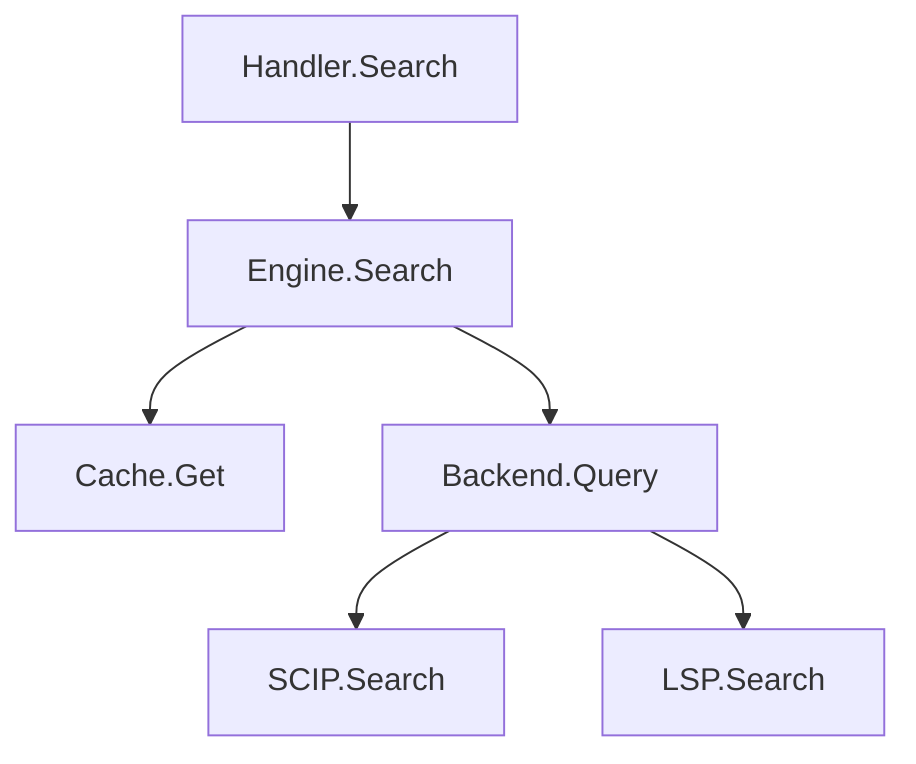
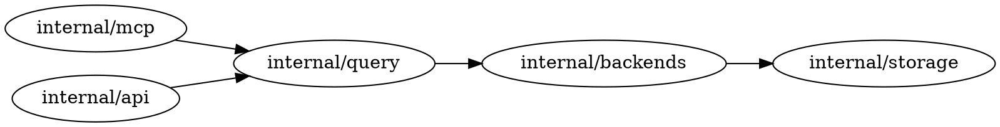

# CKB v8.1 Roadmap

**Theme:** Upstream code quality — catch issues before they become PRs.

**Inspiration:** Adapted from CodeRabbit's review-time features, shifted left into the development phase via MCP.

---

## Features

### 1. Project Conventions (`conventions`)

Define coding rules and conventions in `.ckb/conventions.yaml` that AI tools can query when writing code — not a linter, but contextual guidance served via MCP.

#### Config Format

```yaml
# .ckb/conventions.yaml
conventions:
  - scope: "**/*_test.go"
    rules:
      - "Use table-driven tests with t.Run subtests"
      - "Name test cases in snake_case describing the scenario"

  - scope: "internal/mcp/**"
    rules:
      - "All tool handlers must return CkbError, never raw fmt.Errorf"
      - "Include remediation in all error responses"

  - scope: "**/*.go"
    rules:
      - "Wrap errors with fmt.Errorf and %w"
      - "Exported functions require doc comments"
      - "Context is always the first parameter"

  - scope: "internal/query/**"
    rules:
      - "All public methods on Engine must check cache first"
      - "Use QueryPolicy for backend selection, never call backends directly"
```

#### MCP Tool: `getConventions`

```json
// Input
{
  "path": "internal/mcp/tool_impls.go"  // file being edited (optional)
}

// Output
{
  "conventions": [
    {
      "scope": "internal/mcp/**",
      "rules": [
        "All tool handlers must return CkbError, never raw fmt.Errorf",
        "Include remediation in all error responses"
      ]
    },
    {
      "scope": "**/*.go",
      "rules": [
        "Wrap errors with fmt.Errorf and %w",
        "Exported functions require doc comments",
        "Context is always the first parameter"
      ]
    }
  ]
}
```

Scope matching uses the same glob patterns as `.gitignore`. When `path` is provided, only conventions whose scope matches are returned.

#### Implementation

| File | Purpose |
|------|---------|
| `internal/conventions/conventions.go` | YAML parsing, scope matching, convention lookup |
| `internal/conventions/conventions_test.go` | Tests |
| `internal/mcp/tool_impls_conventions.go` | MCP handler |

---

### 2. Pre-Commit Change Validation (`reviewChange`)

A compound tool that combines impact analysis + affected tests + API breakage + convention violations into a single "here's what's risky about this diff" response. AI tools call it before committing rather than waiting for a PR review bot.

#### MCP Tool: `reviewChange`

```json
// Input
{
  "diff": "...",           // raw diff string (optional, uses git working tree if omitted)
  "staged": true,         // review staged changes only (default: false)
  "includeConventions": true  // check against project conventions (default: true)
}

// Output
{
  "summary": "Modifies 3 files in internal/query, affects 12 downstream callers",
  "impact": {
    "filesChanged": 3,
    "symbolsModified": ["Engine.Search", "Engine.Resolve"],
    "downstreamCallers": 12,
    "moduleSpread": 4
  },
  "apiBreakage": [
    {
      "symbol": "Engine.Search",
      "change": "parameter added",
      "affectedCallers": 8
    }
  ],
  "affectedTests": [
    "internal/query/engine_test.go",
    "internal/mcp/tool_impls_test.go"
  ],
  "conventionViolations": [
    {
      "file": "internal/query/engine.go",
      "line": 45,
      "rule": "Exported functions require doc comments",
      "scope": "**/*.go"
    }
  ],
  "risk": {
    "level": "high",
    "score": 0.72,
    "factors": [
      "API breaking change (parameter added to exported function)",
      "High module spread (4 modules affected)",
      "Convention violation (missing doc comment)"
    ]
  },
  "suggestions": [
    "Add doc comment to Engine.Search",
    "Run affected tests: go test ./internal/query/... ./internal/mcp/...",
    "Consider a deprecation path for the parameter change"
  ]
}
```

#### Implementation

Internally composes:
1. Parse diff (or read from git working tree / staging area)
2. Identify modified symbols via SCIP mapping
3. Run `prepareChange` logic for each modified symbol
4. Run `compareAPI` logic for exported symbol changes
5. Run `getAffectedTests` for test mapping
6. Match changed files against `conventions.yaml` rules (basic text check, not AST-level)
7. Aggregate risk score across all factors

| File | Purpose |
|------|---------|
| `internal/query/review.go` | Core `ReviewChange()` orchestration |
| `internal/query/review_test.go` | Tests |
| `internal/mcp/tool_impls_review.go` | MCP handler |

---

### 3. Graph Visualization (`createGraph`)

A single tool that generates visual graph output (Mermaid or DOT format) from CKB's structural data. Supports multiple graph types via options.

#### MCP Tool: `createGraph`

```json
// Input
{
  "type": "call-graph",        // see graph types below
  "target": "Engine.Search",   // symbol, file, or module (depends on type)
  "format": "mermaid",         // "mermaid" | "dot"
  "depth": 2,                  // traversal depth (default: 2, max: 4)
  "direction": "both"          // "callers" | "callees" | "both" (for call-graph)
}

// Output
{
  "format": "mermaid",
  "graph": "graph TD\n  Engine.Search --> Backend.Query\n  Engine.Search --> Cache.Get\n  Handler.Search --> Engine.Search\n  ...",
  "nodeCount": 12,
  "edgeCount": 15,
  "truncated": false
}
```

#### Graph Types

| Type | Target | Description |
|------|--------|-------------|
| `call-graph` | symbol | Callers/callees of a symbol |
| `dependency` | file or module | Import/export relationships |
| `architecture` | module or directory | Module-level dependency structure |
| `impact` | symbol | Blast radius visualization for a change |
| `coupling` | file or module | Co-change relationships from git history |

#### Examples

**Call graph (Mermaid):**


**Architecture (DOT):**


#### Implementation

| File | Purpose |
|------|---------|
| `internal/graph/graph.go` | Graph builder: nodes, edges, render to Mermaid/DOT |
| `internal/graph/graph_test.go` | Tests |
| `internal/graph/types.go` | Graph type definitions, format enum |
| `internal/mcp/tool_impls_graph.go` | MCP handler dispatching to appropriate data source |

The handler fetches data from existing query engine methods (`GetCallGraph`, `GetArchitecture`, `GetCoupling`, etc.) and passes it through the graph builder for format conversion.

---

## Success Metrics

| Metric | Target |
|--------|--------|
| Convention lookup latency | <50ms p95 |
| `reviewChange` response time | <3s p95 |
| `createGraph` response time | <1s p95 |
| Graph node limit before truncation | 100 nodes |
| Convention violation detection | Path-scoped text matching (not AST) |

---

## Implementation Order

```
v8.1
├── 1. conventions package + getConventions tool
├── 2. createGraph (depends on existing call graph / architecture data)
└── 3. reviewChange (depends on conventions + existing impact/API tools)
```

---

## Related Documents

- `docs/plans/roadmap-v8.md` — v8.0 roadmap (compound operations, streaming)
- `docs/featureplans/change-impact-analysis.md` — Impact analysis spec (used by reviewChange)
